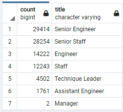
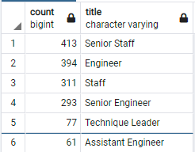

# Employee Database with SQL

## Overview of Employee Database Analysis wtih SQL
Pewlett-Hackard will soon be experiencing a very large portion of their workforce retiring.  In order to plan and respond to this, the company needs to know the number of retiring employees, their titles, and employees that may be able to provide mentorship to new hires replacing the retiring employees.

## Employee Database Analysis Results
    
* Compounding what would already be a disruptive loss of human resources is the fact that most of the retiring positions are experienced senior engineers and senior staff. 
* A very small number of managers and leadership are retiring.  Most positions that will need to be filled will be technically focused. 
* There is a small pool of eligible mentors compared to retiring positions.  
* It would appear that, even though there are only two managers retiring, there are no other managers eligible to provide mentorship to new hires. 

## Employee Database Analysis Summary
* How many roles will need to be filled as the "silver tsunami" begins to make an impact?
  **90,398  
* Are there enough qualified, retirement-ready employees in the departments to mentor the next generation of Pewlett Hackard employees?
  **Unfortunately, there are not enough qualified retirement-ready employees in the departments to mentor the next generation.  As mentioned earlier, there is only one eligible mentor to every 58~59 positions that will soon be open, and in the case of management, there are no eligiblie mentors at all.  Aggressive training and recruitment programs may be necessary to ease the transition.  
  
* The following query was written to query and display total available mentors by title that has been used earlier in this analysis, and now to demonstrate the significant lack of qualified mentors.  

```sql
SELECT COUNT(title), title
INTO promo_elig
FROM mentorship_eligibility
GROUP BY title
ORDER BY COUNT(title) DESC;

SELECT * FROM promo_elig
```
